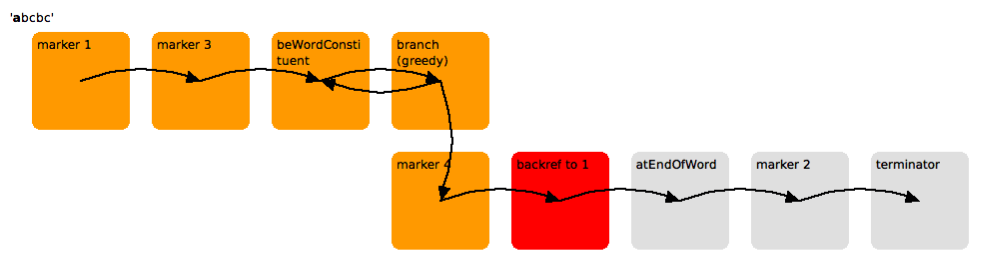

# Regex-Tools

Experimental visualizations and exploratory tools for [Squeak](http://squeak.org/)'s regex engine. Bleeding edge research prototype. Depends on some regex features and changes that are not yet integrated into the Squeak Trunk. Animations were created with the help of the range retracing API of the [TraceDebugger](https://github.com/hpi-swa-lab/squeak-tracedebugger).

## Impressions

**Simple backreference (`(\w+)\1\>`):**

**Backtracking (`\d+(_\d+)*`):**

**Double words (`(\<\w+) \1\>`):**

